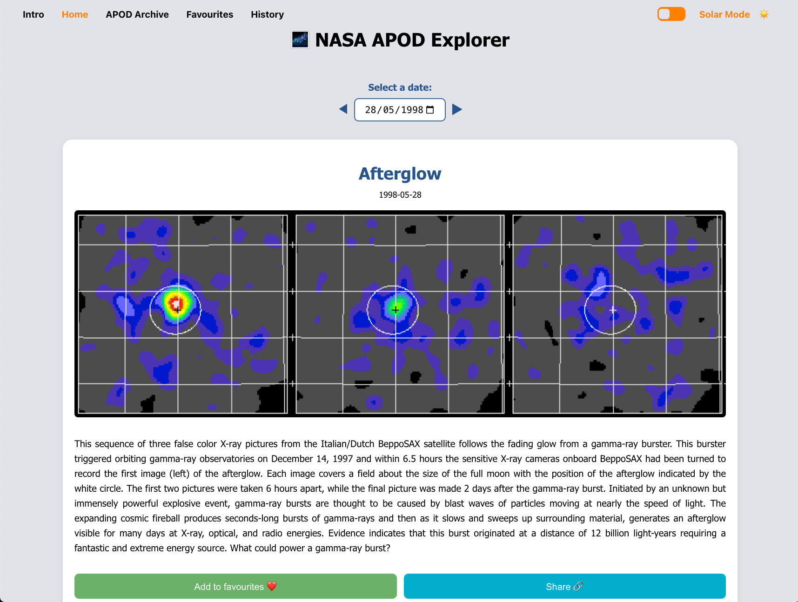
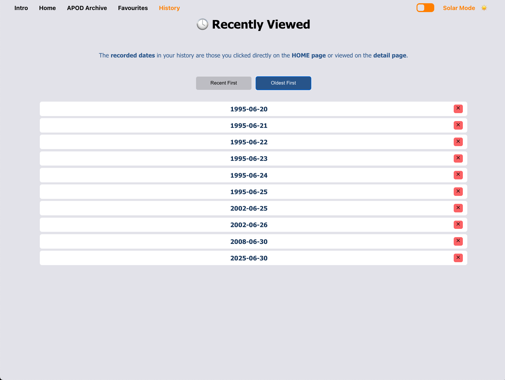

# 🚀 NASA APOD Project
Have you ever looked up at the **night sky** after a long, tough day? Have you ever gazed at the stars when you felt like giving up on everything?
<br /><br />
When life gets hard, I often find myself searching for the **moon** and the **stars**, quietly saying hello to my loved ones who left this world too soon. 
<br /><br />
Living in **Ireland**, we have many cloudy days, which makes it hard to see a clear night sky. Thankfully, **NASA** shares breathtaking photos from beyond the night sky — real glimpses into the universe. I hope this site can be a place you visit whenever you miss the stars and wonder what lies beyond.
<br /><br />
Welcome to the **NASA APOD Project**, a web application that lets you explore space through NASA's Astronomy Picture of the Day (APOD) and other NASA open APIs. Built using **React** for the frontend and **Node.js + Express** for the backend, this project showcases space data in a beautiful and interactive way.
<br /><br />
**This project is dedicated to dreamers like me.**
<br /><br /><br />


## 🛰️ Tech Stack
- **Frontend**: React, Context API, CSS
- **Backend**: Node.js, Express
- **API**: NASA Open API (APOD)
<br /><br /><br />


## ✨ Features to Explore
- Intro page that brings a **mini universe** to your screen
- Browse **NASA's Astronomy Picture of the Day (APOD)**
- Explore the **APOD archive** by date and media type
- Save your **favourite content** to a dedicated favourites page
- View and interact with your **browsing history**
- Easily select and explore APODs using a **date picker**
- Enjoy an **interactive UI** with filters, search, modals, loading and more
- Robust **error handling** for failed API calls
- **Responsive design** that works seamlessly across devices
- **Global context** for efficient state management (e.g., history and favourites)
<br /><br /><br />


## 💻 Project Structure
```plaintext
nasa-apod-project/
├── backend/
│   ├── controllers/
│   │   └── apodController.js
│   ├── routes/
│   │   └── apod.js
│   ├── services/
│   │   └── nasaApiService.js
│   ├── index.js
│   ├── package.json
│   └── ...
├── frontend/
│   ├── public/
│   ├── src/
│   │   ├── components/
│   │   │   ├── APODCard/
│   │   │   │   ├── APODCard.js
│   │   │   │   └── APODCard.css
│   │   │   ├── DatePicker/
│   │   │   │   ├── DatePicker.js
│   │   │   │   └── DatePicker.css
│   │   │   ├── Loading/
│   │   │   │   ├── Loading.js
│   │   │   │   └── Loading.css
│   │   │   ├── Modal/
│   │   │   │   ├── Modal.js
│   │   │   │   └── Modal.css
│   │   │   ├── NavBar/
│   │   │   │   ├── NavBar.js
│   │   │   │   └── NavBar.css
│   │   │   └── Spacebackground.js
│   │   ├── contexts/
│   │   │   ├── GlobalContext.js
│   │   │   └── HistoryContext.js
│   │   ├── pages/
│   │   │   ├── APODArchive/
│   │   │   │   ├── APODArchive.js
│   │   │   │   └── APODArchive.css
│   │   │   ├── Favourites/
│   │   │   │   ├── Favourites.js
│   │   │   │   └── Favourites.css
│   │   │   ├── History/
│   │   │   │   ├── History.js
│   │   │   │   └── History.css
│   │   │   ├── Home.js
│   │   │   └── Intro/
│   │   │       ├── Intro.js
│   │   │       └── Intro.css
│   │   ├── App/
│   │   │   ├── App.js
│   │   │   └── App.css
│   │   ├── index/
│   │   │   ├── index.js
│   │   │   └── index.css
│   │   └── ...
│   ├── package.json
│   └── ...
└── README.md
```
<br /><br /><br />


## ⚙️ Setup
### 1️⃣ Clone the repository
```
git clone https://github.com/jinantonic/nasa-apod-project.git
cd nasa-apod-project
```
<br />

### 2️⃣ Backend setup
1. Navigate to the backend directory:
```
cd backend
```
<br />

2. Install dependencies:
```
npm install
```
<br />

3. Start the backend server:
```
node index.js
```

The backend server will run on 'http://localhost:5001' by default (or as configured).
<br /><br />

### 3️⃣ Frontend setup
1. Navigate to the frontend directory:
```
cd frontend
```
<br />

2. Install dependencies:
```
npm install
```
<br />

3. Start the development server:
```
npm start
```

The frontend development server will run on 'http://localhost:3000' by default.
<br /><br /><br />


## 🚀 Deployment
This project is deployed using two separate services for backend and frontend:
### 1️⃣ Backend
The backend server is deployed on [Render](https://render.com/). It serves the API endpoints and handles requests to NASA's data.
The live backend URL is [here](https://nasa-apod-project.onrender.com), but it only serves API routes like `/api/apod`. Example API endpoint is [here](https://nasa-apod-project.onrender.com/api/apod).
<br /><br />

### 2️⃣ Frontend
The frontend is deployed on [Vercel](https://vercel.com/).
It provides the user interface, consuming the backend API to display NASA APOD data interactively.
The live frontend URL is [here](https://nasa-apod-project-ashy.vercel.app/).
<br /><br /><br />


## 🌌 API Reference
This project uses NASA's public APIs, primarily the Astronomy Picture of the Day (APOD) API, which you can find [here](https://api.nasa.gov/).
<br /><br /><br />


## 📸 Screenshots
### Intro Page  
<br />
<br /><br />

### Home Page  
<br />
<br /><br />

### APOD Archive  
<br />
<br /><br />

### Favourites Page  
<br />
<br /><br />

### History Page  
<br />

<br /><br /><br />


## 💡 Future Improvements
- Add advanced keyword-based filters and search capabilities
- Support for additional NASA APIs (e.g., Mars Rover Photos, NeoWs)
- User login and authentication for personalised features
- Progressive Web App (PWA) support for offline access and improved mobile experience
- More pages to explore various space and astronomy topics
- AI-powered features (e.g., auto-tagging images, image recognition, personalised recommendations)
